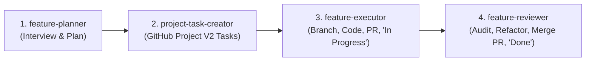

# Mandatory AI Agent Guidelines & Workflow Rules

> [!CRITICAL]
> BEFORE building, modifying, or creating ANY feature in this project, the AI Agent MUST strictly execute the **4-Stage Feature Skill Suite** in order without skipping any step.

---

## 📌 The Mandatory 4-Stage Feature Workflow

### Phase 1: Planning (`feature-planner`)
- Ask targeted questions to clarify scope, UI/UX expectations, and constraints.
- Formulate a detailed feature specification and break it into atomic tasks.
- Obtain user alignment on the plan.

### Phase 2: Project Task Creation (`project-task-creator`)
- Connect to GitHub GraphQL API for `@phmmyadmin's tasks` (`PVT_kwHOAkgXus4BfhjX`).
- Add each task as a project item using `addProjectV2DraftIssue`.
- Record item IDs for tracking.

### Phase 3: Feature Execution (`feature-executor`)
- Move task item status to **In Progress** (`47fc9ee4`).
- Create a dedicated Git feature branch (`git checkout -b feature/<name>`).
- Write clean, accessible code adhering to the **Warm Light Mode** design system.
- Verify production build locally (`npm run build`).
- Commit and push branch to GitHub remote.
- Open a Pull Request using GitHub MCP `create_pull_request`.

### Phase 4: Review, Refactoring & Merge (`feature-reviewer`)
- Perform a deep code review (cleanliness, edge cases, WCAG 2.1 AA accessibility).
- Refactor and apply improvements directly if needed, re-test build, and commit.
- **Merge the Pull Request on GitHub** using `merge_pull_request` MCP tool.
- Switch to `main` branch, pull latest merged code (`git pull origin main`), and delete local feature branch.
- Move task item status to **Done** (`98236657`) in GitHub Project V2.

---

## 🎨 Design System Principles
- **Theme**: Warm Light Mode (`#FAFAF7` background, `#FFFFFF` cards, `#F5F3EE` alt surfaces).
- **Typography**: Outfit for headings, Inter for body text, JetBrains Mono for code/patterns.
- **Accessibility**: WCAG 2.1 AA compliant (`:focus-visible` outlines, skip links, aria-labels, touch targets).
