<div align="center">

# 🇵🇭 Tagalog Master

### *The Next-Generation AI-Powered Tagalog Language Learning Platform*

[](https://react.dev/)
[](https://vitejs.dev/)
[](https://vitest.dev/)
[](https://supabase.com/)
[](https://github.com/open-spaced-repetition/fsrs4anki)
[](https://ai.google.dev/)
[](https://web.dev/progressive-web-apps/)
[](https://www.w3.org/WAI/WCAG21/quickref/)

<br />

**An interactive, offline-ready web application engineered to master Tagalog through Anki-grade spaced repetition, client-side PowerPoint slide ingestion, automated Gemini AI curriculum structuring, and real-time multi-device cloud synchronization.**

<br />

[✨ Highlights](#-highlights) • [🎴 FSRS-5 Repetition](#-anki-grade-fsrs-5-spaced-repetition) • [🤖 PPTX Ingestion & AI](#-in-browser-pptx-ingestion--gemini-ai) • [📖 4-Pillar Curriculum](#-4-pillar-curriculum-framework) • [📸 Visual Tour](#-visual-tour) • [🚀 Quick Start](#-quick-start) • [📐 Architecture](#-system-architecture)

<br />

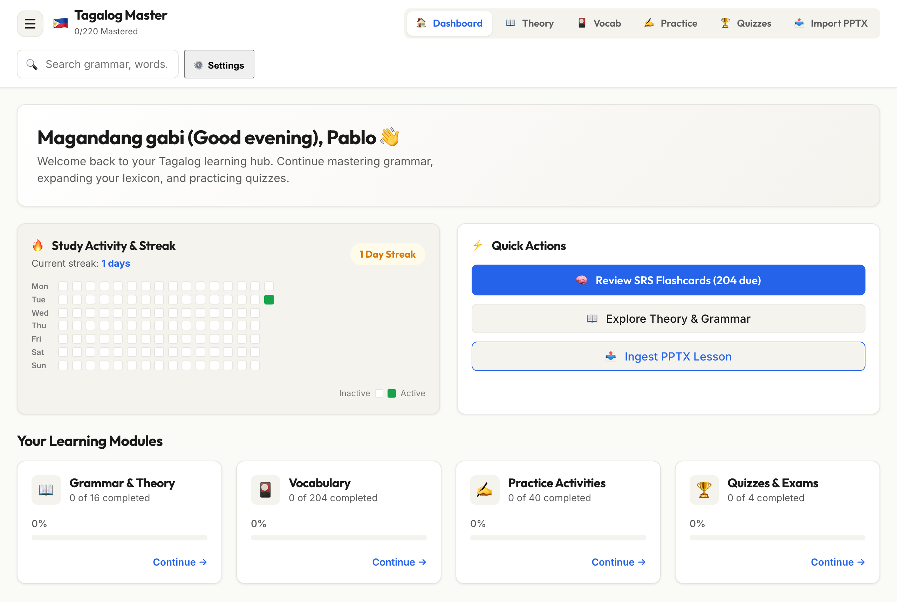

</div>

---

## 🌟 Highlights

- 🧠 **Anki-Grade FSRS-5 Spaced Repetition**: Modern 19-parameter Difficulty-Stability-Retrievability (DSR) memory model outperforming legacy SM-2 with precise forgetting curves, retrievability forecasts, and custom retention targets.
- 🤖 **In-Browser PPTX Ingestion via Gemini AI**: Drag-and-drop raw `.pptx` presentation files directly into the browser. Client-side JSZip XML parsing + Google Gemini 2.5 Flash transforms raw slides into structured, production-ready lessons in seconds.
- 📖 **Rigorous 4-Pillar Curriculum Structure**: Every master lesson contains structured grammar theory tables with audio synthesis (`🔊`), $\ge 10$ deduplicated vocabulary cards, $\ge 4$ fill-in-the-blank practice activities, and an 8-question mastery exam.
- 🔊 **Native Web Speech Synthesis (TTS)**: Built-in pronunciation audio for vocabulary and interactive theory tables, supporting both standard Filipino and international voice accents.
- 🎴 **Smart Deduplicated Dictionary**: Search 204+ curated master terms with deep fuzzy multi-field search (`word`, `meaning`, `partOfSpeech`, `lesson`, `example`).
- ⚡ **Cram Study Mode**: Instant bypass of daily new card caps to review all available terms before exams.
- ☁️ **Full-Stack PostgreSQL Cloud Sync**: Client-side Supabase integration with automatic schema merging, auth sessions, and offline fallback.
- 📱 **Offline-First PWA**: Installable Progressive Web App with service worker caching, instant load times, and standalone mobile app experience.
- 🎨 **Warm Light Mode Design System**: Beautiful, readable typography (Outfit + Inter + JetBrains Mono) with WCAG 2.1 AA keyboard accessibility and focus rings.
- 🛡️ **Comprehensive Integration Test Suite**: 100% test coverage with Vitest, JSDOM, and automated Git `pre-push` hooks.

---

## 🎴 Anki-Grade FSRS-5 Spaced Repetition

Tagalog Master implements the **Free Spaced Repetition Scheduler (FSRS-5)**, a state-of-the-art cognitive memory algorithm based on the DSR model:

$$R(t, S) = \left(1 + \text{factor} \cdot \frac{t}{S}\right)^{-\text{decay}}$$

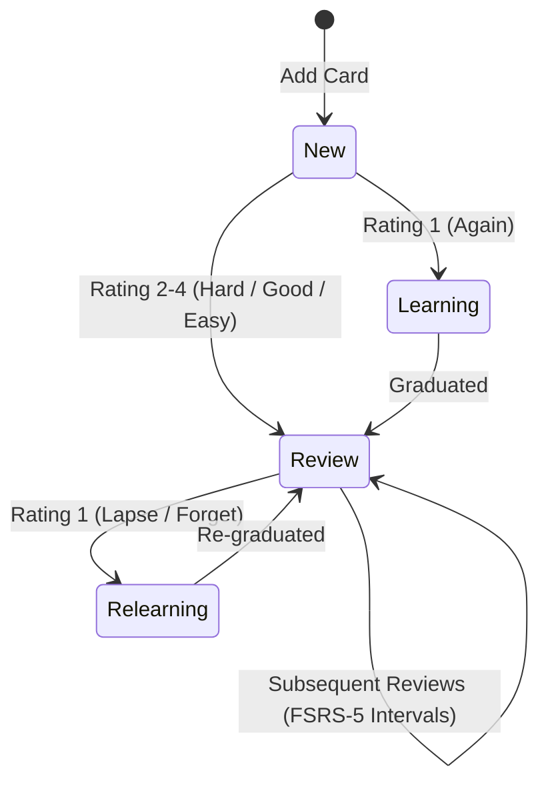

### Key FSRS-5 Capabilities:
- **4 Rating Grades**: `1: Again`, `2: Hard`, `3: Good`, `4: Easy`.
- **Live Interval Previews**: See exact future review intervals (`10m`, `1d`, `3d`, `8d`) before rating.
- **Double-Click & Key-Repeat Prevention**: Built-in submission locking ensures 100% single-click rating integrity.
- **Session Immutability**: Auto-mastering or filtering cards never resets the active review queue mid-session.
- **Undo Capability**: Seamlessly revert the last reviewed card with `Backspace` or `Z`.

### ⌨️ Keyboard Shortcuts

| Key | Action | Description |
|---|---|---|
| <kbd>Space</kbd> | **Flip Card** | Reveal the back of the active flashcard |
| <kbd>1</kbd> | **Again** | Card forgotten $\rightarrow$ schedule for immediate relearning |
| <kbd>2</kbd> | **Hard** | Difficult recall $\rightarrow$ shorter interval increase |
| <kbd>3</kbd> | **Good** | Standard recall $\rightarrow$ optimal FSRS stability progression |
| <kbd>4</kbd> | **Easy ⭐** | Instant recall $\rightarrow$ bonus stability & auto-master |
| <kbd>Backspace</kbd> / <kbd>Z</kbd> | **Undo** | Revert previous rating and restore card state |

---

## 🤖 In-Browser PPTX Ingestion & Gemini AI

Import new lecture slides directly in your browser without requiring a backend server or Python dependencies:

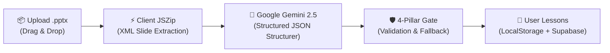

1. **Client-Side XML Parsing**: `pptxBrowserParser.js` decompresses the `.pptx` container in-memory using `JSZip`, extracting slide titles, bullet hierarchies, and body text.
2. **AI Curriculum Structuring**: `aiLessonStructurer.js` prompts Google Gemini 2.5 Flash to organize raw text into grammar theory tables, vocabulary with examples, fill-in exercises, and an 8-question mastery quiz.
3. **Automatic Fallback Recovery**: If AI returns sparse vocabulary, the engine automatically extracts terms from grammar tables and rules.
4. **Instant Persistence**: Seeded into the master curriculum and synced across devices.

---

## 📖 4-Pillar Curriculum Framework

Every lesson in Tagalog Master satisfies the mandatory **4-Pillar Quality Gate**:

```
├── 📖 Pillar 1: Theory Topics (Structured grammar rules, syntax tables, TTS audio)
├── 🎴 Pillar 2: Vocabulary Cards (≥10 unique terms with part-of-speech, meanings, examples)
├── ✍️ Pillar 3: Practice Activities (≥4 interactive fill-in-the-blank & multiple choice drills)
└── 🏆 Pillar 4: Mastery Exam (8-question comprehensive quiz with explanation remediation)
```

### Master Modules Included:
- **Lesson 02**: Pronouns (*Ako, Ikaw, Siya*), Demonstratives (*Ito, Iyan, Iyon*), and Inverted `Ay` Syntax.
- **Lesson 03**: Markers (*Ang / Si / Sina*), Adjectives, Pluralization (*Mga*), and Negative Predicates (*Hindi*).
- **Lesson 04**: Equational Sentences, Existential Particles (*May / Mayroon / Wala*), and Quantity Expressions.
- **Lesson 05**: Inalienable & Alienable Possession (*Akin / Ko / Ng*), Location Prepositions (*Nasa / Sa*).
- **Lesson 06**: Verb Morphologies (*-UM- / MAG- / MA-* Actor Focus), Verb Tenses (*Naganap, Nagaganap, Magaganap*).
- **Lesson 07**: Pseudo-Verbs (*Gusto / Ayaw / Puwede / Kailangan*), Enclitics (*Ba, Na, Pa, Din, Daw, Nga*), Interrogatives.
- **Lesson 08**: Degrees of Comparison (Equality *Kasing-*, Inequality *Mas... Kaysa*, Superlative *Pinaka-*, Intensive *Napaka-*).

---

## 📸 Visual Tour

<div align="center">

### 🎴 Spaced Repetition Flashcards & FSRS Review
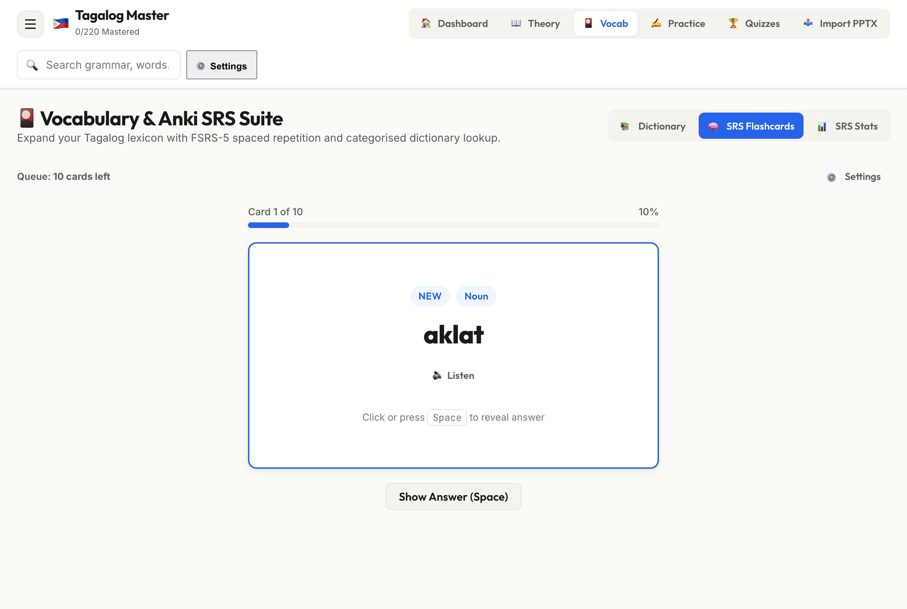

<br /><br />

### 📖 Grammar Theory Tables with Audio Pronunciation
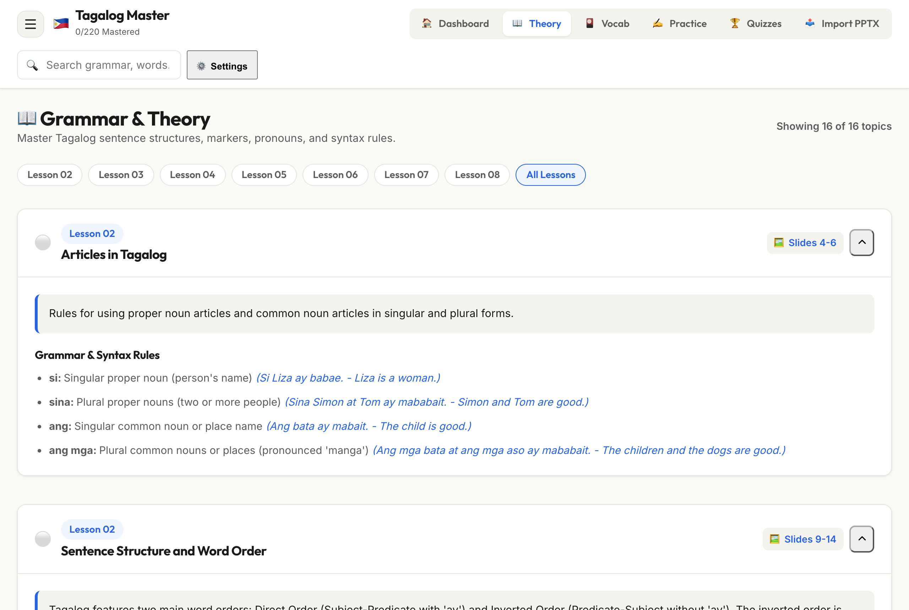

<br /><br />

### 🎴 Smart Vocabulary Dictionary & Multi-Field Search
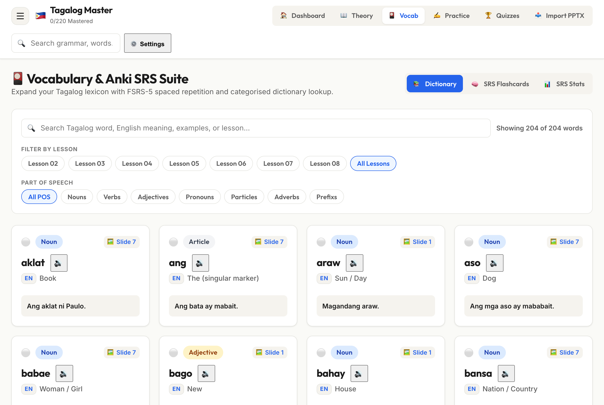

<br /><br />

### ✍️ Interactive Practice Exercises
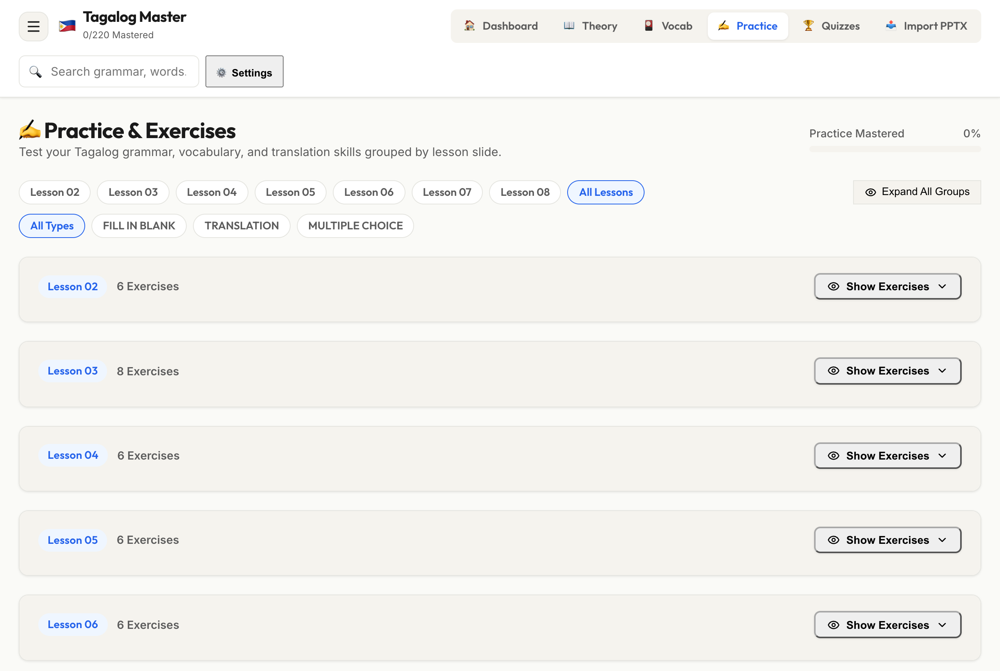

<br /><br />

### 🏆 Mastery Exams & Custom AI Quiz Generation
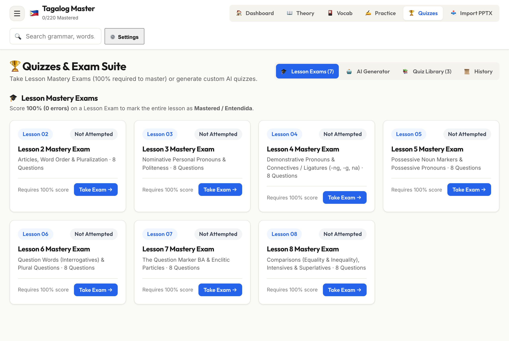

<br /><br />

### 📤 In-Browser PPTX Slide Ingestion
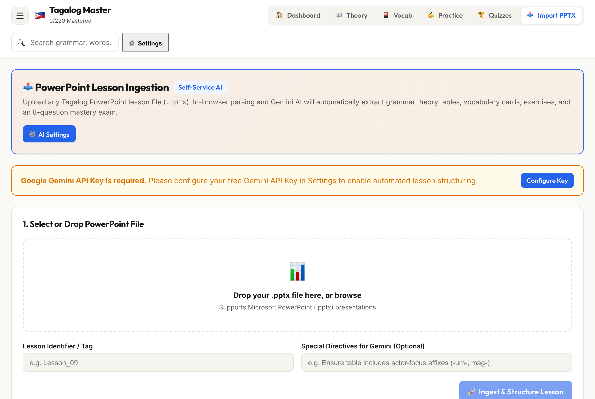

<br /><br />

### ⚙️ Unified Settings (Cloud Sync, FSRS Parameters & Gemini AI)
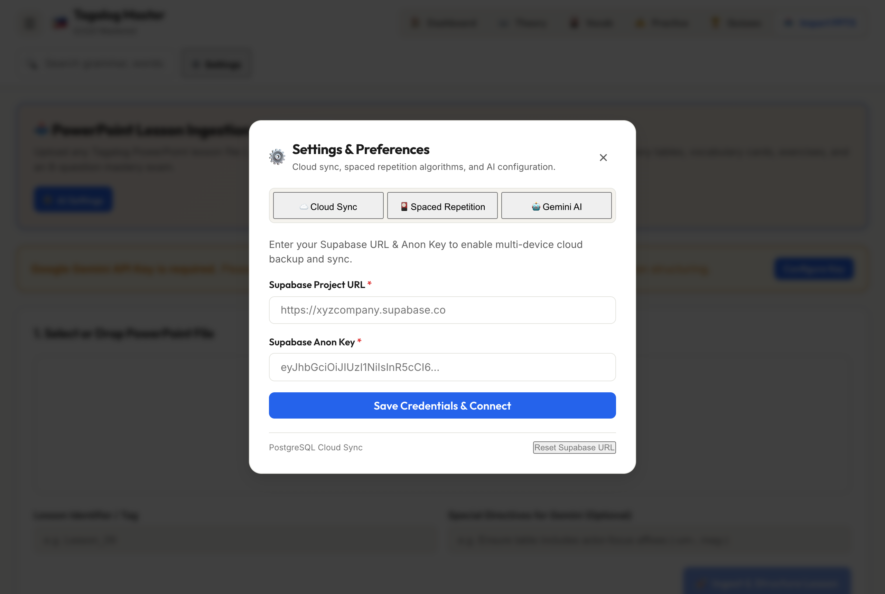

</div>

---

## 📐 System Architecture

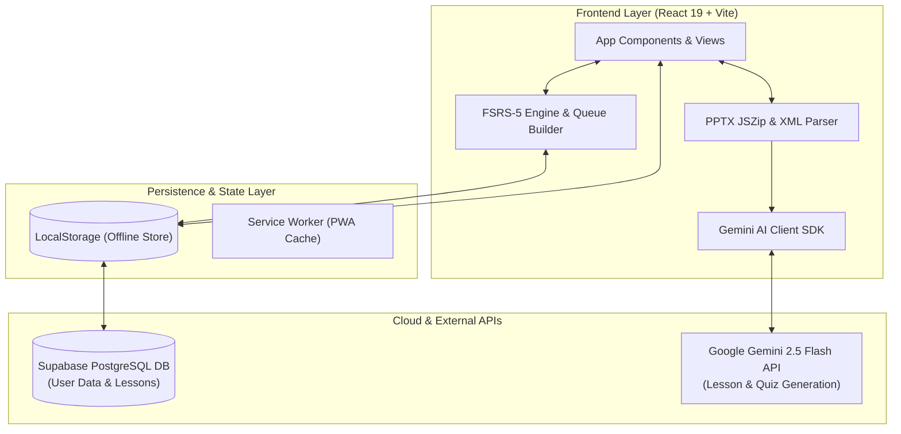

---

## 🚀 Quick Start

### Prerequisites
- **Node.js**: `v18.0.0` or higher (Node `v20+` recommended)
- **npm**: `v9.0.0` or higher

### Installation & Setup

1. **Clone the repository**:
   ```bash
   git clone https://github.com/phmmyadmin/Tagalog-Learning.git
   cd Tagalog-Learning
   ```

2. **Install dependencies**:
   ```bash
   npm install
   ```

3. **Start the local development server**:
   ```bash
   npm run dev
   ```
   Open your browser at `http://localhost:3000/`.

4. **(Optional) Configure Gemini API & Supabase**:
   - Click **⚙️ Settings** in the top navigation bar.
   - Enter your free **Google Gemini API Key** from [Google AI Studio](https://aistudio.google.com/).
   - Sign in with **Supabase Cloud** to enable multi-device synchronization.

---

## 🧪 Testing & Quality Assurance

Tagalog Master employs strict **Test-Driven Development (TDD)** and automated git hooks:

```bash
# Run the complete integration test suite once
npm test

# Run tests in interactive watch mode
npm run test:watch

# Verify production build & slide extraction
npm run build
```

### Git Hooks & CI/CD Pipeline
- **`pre-commit`**: Runs `npm test` before every local commit.
- **`pre-push`**: Runs `npm test && npm run build` before pushing to any remote branch, ensuring zero broken builds or failing tests reach GitHub.

---

## 🛠️ Tech Stack

| Domain | Technology |
|---|---|
| **Core Framework** | [React 19](https://react.dev/), [Vite 6](https://vitejs.dev/) |
| **Spaced Repetition** | [FSRS-5 Algorithm](https://github.com/open-spaced-repetition/fsrs4anki) (19-parameter DSR model) |
| **Artificial Intelligence** | [Google Gemini 2.5 Flash API](https://ai.google.dev/) |
| **File Processing** | [JSZip 3.10](https://stuk.github.io/jszip/) (In-Browser XML PPTX Parser) |
| **Backend & Cloud Sync** | [Supabase PostgreSQL](https://supabase.com/) |
| **Testing** | [Vitest 4](https://vitest.dev/), [JSDOM](https://github.com/jsdom/jsdom) |
| **Git Automation** | [Husky 9](https://typicode.github.io/husky/) (`pre-commit`, `pre-push`) |
| **Offline & PWA** | [Vite PWA Plugin](https://vite-pwa-org.netlify.app/) (Workbox) |
| **Icons & Design** | [Lucide React](https://lucide.dev/), Warm Light Design System |

---

## 📄 License

This project is open source and available under the [MIT License](LICENSE).

<div align="center">

Made with ❤️ and ☕ for Tagalog learners worldwide 🇵🇭

</div>
