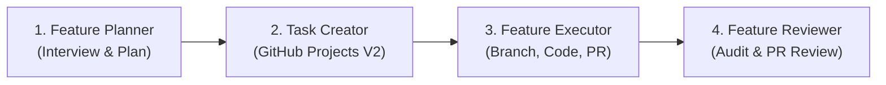

# Master Feature Workflow Suite

This master skill orchestrates the end-to-end feature creation lifecycle across 4 distinct phases:

## Phase Breakdown & Skills Triggered

| Phase | Skill | Primary Goal | Key Deliverable |
|---|---|---|---|
| **1. Plan** | `feature-planner` | Interactive Q&A interview with user until requirements are fully clear | Detailed Feature Specification + Atomic Task Breakdown |
| **2. Tasks** | `project-task-creator` | Create tracked items in `@phmmyadmin's tasks` (#1) | GitHub Project V2 Items (`PVTI_...`) |
| **3. Execute** | `feature-executor` | Create git feature branch, implement code, build check, commit, push & PR | Git Branch + Commits + GitHub PR + Project Status Move |
| **4. Review** | `feature-reviewer` | Code diff audit, visual check, build test, PR review report | QA Audit Report + GitHub PR Approval/Review |

---

## Execution Guide

### Phase 1: Planning (`feature-planner`)
1. Ask the user targeted questions to clarify scope, UI/UX expectations, components, and acceptance criteria.
2. Formulate a step-by-step implementation plan.
3. Obtain user confirmation on the plan.

### Phase 2: GitHub Project Tasks (`project-task-creator`)
1. Connect to GitHub GraphQL API for `@phmmyadmin's tasks` (`PVT_kwHOAkgXus4BfhjX`).
2. Add each task as a project item using `addProjectV2DraftIssue`.
3. Report created project item links to the user.

### Phase 3: Implementation & PR (`feature-executor`)
1. Create and switch to a git branch `feature/<feature-name>`.
2. Implement components and logic in `src/`.
3. Verify build with `npm run build`.
4. Create granular commits and push to `origin`.
5. Open PR on GitHub linking to the project tasks.

### Phase 4: Code Review & QA (`feature-reviewer`)
1. Inspect `git diff main...HEAD`.
2. Verify code quality, design standards, and zero lints/errors.
3. Submit review summary report to the user and GitHub PR.
